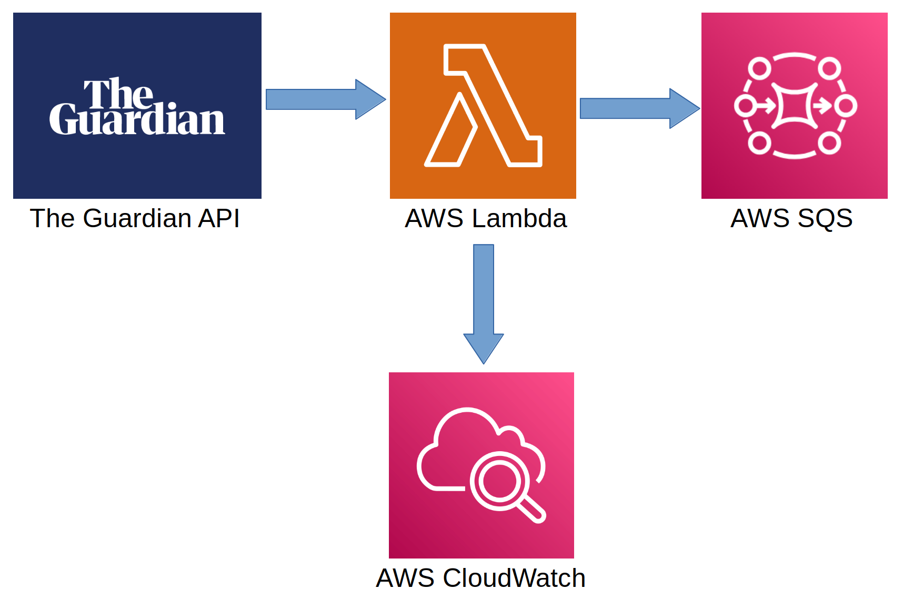
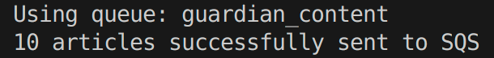
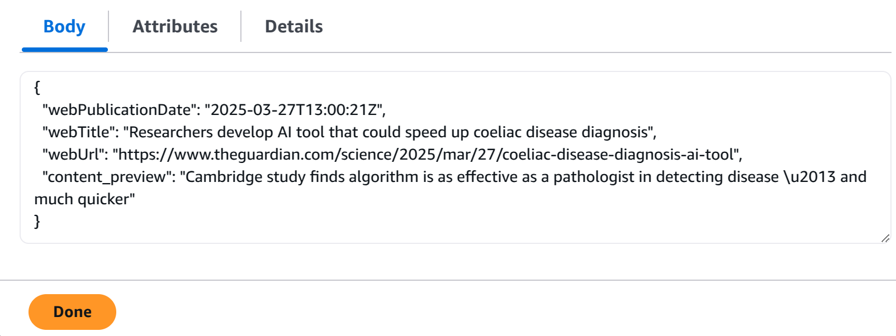

# News Streaming Pipeline

A proof of concept tool developed for Tech Returners which retrieves recent news articles from the Guardian API based on a search term, and sends them to an AWS SQS message broker. This is aimed at use by the marketing and careers teams, and can be used as a component of an AWS application.



## Features
- Search for Guardian articles using a keyword or phrase
- Use the optional 'date from' filter to ensure recent results
- Sends up to 10 articles to your SQS queue in JSON format
- Infrastructure-as-code with Terraform
- CLI invocation for testing
- Lambda function creates CloudWatch logs for monitoring

## Requirements
- Python 3.12
- Terraform
- Guardian API Key [(register here)](https://open-platform.theguardian.com/access/)
- AWS CLI configured with access keys for a user with IAM, Lambda and SQS access
- Safety CLI (free) or a paid Safety account - running `make deploy` will prompt account setup

## How to Run
### Clone
Clone the repostitory and open it in your code editor:
```
git clone github.com/tombracey/News-Streaming-Pipeline
code .
```

### Terraform Setup
Set up the AWS infrastructure:
```
cd terraform
terraform init
terraform apply
```
This will prompt you to enter your Guardian API Key.

### Makefile
In a virtual environment run:
```
make deploy
```
This will install dependencies, run the security and linting checks and pytests.

Each of these steps can also be run individually, e.g. `make lint`.

### CLI Invocation
The syntax for invoking from the tool from the CLI is:
```
python src/handler.py <query> <--date_from> <--queue_name>
```

- The date_from and queue_name arguments are both optional.
- The format for the date_from argument is YYYY-MM-DD.
- queue_name defaults to "guardian_content".

Example invocation:
```
python src/handler.py "machine learning" --date_from 2024-12-01
```

Instructions on invoking can also be found by running:
```
python src/handler.py --help
```

Running from the CLI will return an indication of the success in publishing the messages:



The messages should appear in your SQS queue in the following format (shown in AWS Console):



## Meeting Non-Functional Requirements
- Security vulnerabilities were checked with the `safety` package, which didn't find any vulnerabilities that need resolving.
- PEP-8 compliance of the Python code was checked with `flake8`, which doesn't find any warnings or errors.
- Unit tests can be found in `test/test_handler.py`.
- The complete size of the module is well within the memory limits for Python Lambda dependencies.